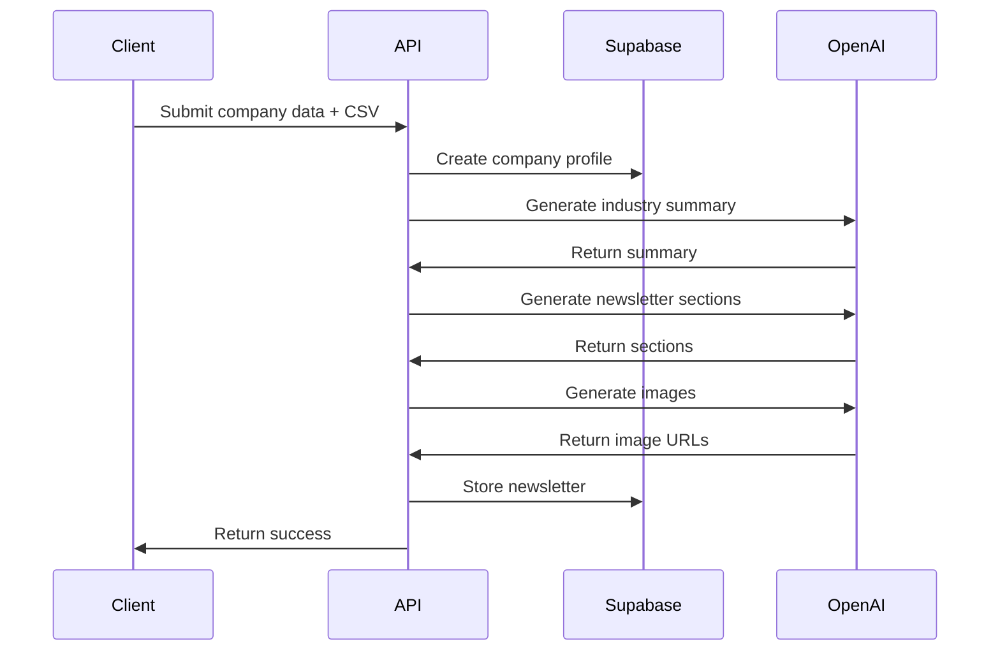

# Newsletter Application Architecture

## Table of Contents
- [System Overview](#system-overview)
- [Core Components](#core-components)
- [Data Flow](#data-flow)
- [Database Schema](#database-schema)
- [API Structure](#api-structure)
- [AI Integration](#ai-integration)
- [Security Considerations](#security-considerations)

## System Overview

### Architecture Diagram
```
┌─────────────────┐     ┌──────────────┐     ┌─────────────┐
│   Next.js App   │────▶│  API Routes  │────▶│  Supabase   │
└─────────────────┘     └──────────────┘     └─────────────┘
         │                      │                    │
         │                      │                    │
         ▼                      ▼                    ▼
┌─────────────────┐     ┌──────────────┐     ┌─────────────┐
│    React UI     │     │  OpenAI API  │     │    Brevo    │
└─────────────────┘     └──────────────┘     └─────────────┘
```

## Core Components

### 1. Frontend Layer (`/pages`, `/components`)
- **Multi-step Form** (`/components/onboarding/`)
  - Company information collection
  - CSV contact upload
  - Form validation and state management

- **Newsletter Preview** (`/components/newsletter/`)
  - Section-based content display
  - Image integration
  - Edit/Approve functionality

### 2. API Layer (`/pages/api/`)
- **Onboarding** (`/api/onboarding/`)
  ```typescript
  POST /api/onboarding
  - Processes company data
  - Handles CSV upload
  - Triggers newsletter generation
  ```

- **Newsletter Management** (`/api/newsletters/`)
  ```typescript
  GET /api/newsletters/:id
  PUT /api/newsletters/:id
  POST /api/newsletters/:id/publish
  ```

### 3. Business Logic (`/utils/`)
- **Newsletter Generation** (`/utils/newsletter.ts`)
  ```typescript
  interface NewsletterSection {
    title: string;
    content: string;
    image_url?: string;
  }

  interface NewsletterContent {
    title: string;
    sections: NewsletterSection[];
    industry_summary: string;
  }
  ```

- **Contact Management** (`/utils/contacts.ts`)
  - CSV parsing
  - Contact validation
  - Email formatting

### 4. Database Layer
- **Tables**
  ```sql
  companies (
    id UUID PRIMARY KEY,
    company_name TEXT NOT NULL,
    industry TEXT NOT NULL,
    target_audience TEXT NOT NULL,
    created_at TIMESTAMP WITH TIME ZONE
  )

  newsletters (
    id UUID PRIMARY KEY,
    company_id UUID REFERENCES companies(id),
    industry_summary TEXT,
    sections JSONB,
    status TEXT,
    created_at TIMESTAMP WITH TIME ZONE
  )

  newsletter_sections (
    id UUID PRIMARY KEY,
    newsletter_id UUID REFERENCES newsletters(id),
    title TEXT NOT NULL,
    content TEXT NOT NULL,
    image_url TEXT,
    section_order INTEGER
  )

  contacts (
    id UUID PRIMARY KEY,
    company_id UUID REFERENCES companies(id),
    email TEXT NOT NULL,
    name TEXT,
    status TEXT DEFAULT 'active',
    created_at TIMESTAMP WITH TIME ZONE
  )
  ```

## Data Flow

### 1. Onboarding Process


### 2. Newsletter Generation
1. **Industry Analysis**
   - Input: Company industry and description
   - Process: GPT generates comprehensive analysis
   - Output: Industry summary for context

2. **Content Generation**
   - Input: Industry summary + company details
   - Process: GPT creates three sections
   - Output: Structured newsletter content

3. **Image Generation**
   - Input: Section content
   - Process: DALL-E creates relevant images
   - Output: Image URLs for each section

## AI Integration

### 1. OpenAI GPT-3.5
- **Purpose**: Text generation
- **Implementation**: `/utils/newsletter.ts`
- **Key Functions**:
  ```typescript
  generateIndustrySummary()
  generateNewsletterContent()
  ```

### 2. DALL-E 3
- **Purpose**: Image generation
- **Implementation**: `/utils/newsletter.ts`
- **Key Function**:
  ```typescript
  generateSectionImage()
  ```

## Security Considerations

### 1. API Security
- Rate limiting on API routes
- Input validation for all forms
- Secure file upload handling

### 2. Database Security
- Row Level Security (RLS) policies
- Prepared statements for queries
- Encrypted sensitive data

### 3. Environment Variables
```env
SUPABASE_URL=
SUPABASE_ANON_KEY=
SUPABASE_SERVICE_ROLE_KEY=
OPENAI_API_KEY=
BREVO_API_KEY=
```

## Best Practices

### 1. Code Organization
- Keep AI prompts in separate config files
- Use TypeScript interfaces for all data structures
- Implement error boundaries for AI operations

### 2. Error Handling
```typescript
try {
  // AI operations
} catch (error) {
  if (error instanceof OpenAIError) {
    // Handle OpenAI specific errors
  } else if (error instanceof DatabaseError) {
    // Handle database errors
  }
  // Log and return appropriate error response
}
```

### 3. Performance
- Cache industry summaries
- Implement lazy loading for images
- Use incremental static regeneration for static pages

## Testing Strategy

### 1. Unit Tests
- Test individual utility functions
- Mock AI responses
- Validate data transformations

### 2. Integration Tests
- Test complete newsletter generation flow
- Verify database operations
- Check email sending functionality

### 3. E2E Tests
- Test complete user journey
- Verify form submissions
- Check newsletter preview and editing

## Deployment Considerations

### 1. Environment Setup
- Configure all required environment variables
- Set up database migrations
- Configure CORS policies

### 2. Monitoring
- Implement error tracking
- Monitor API usage
- Track performance metrics

### 3. Scaling
- Implement caching strategies
- Use connection pooling
- Configure auto-scaling policies
